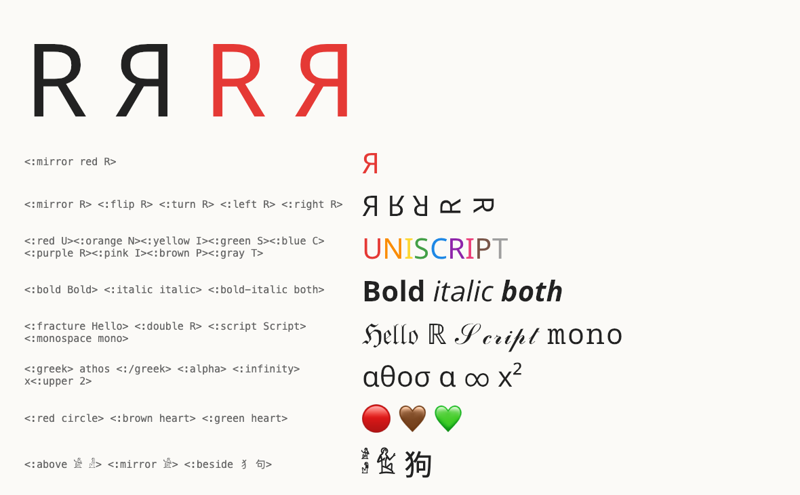
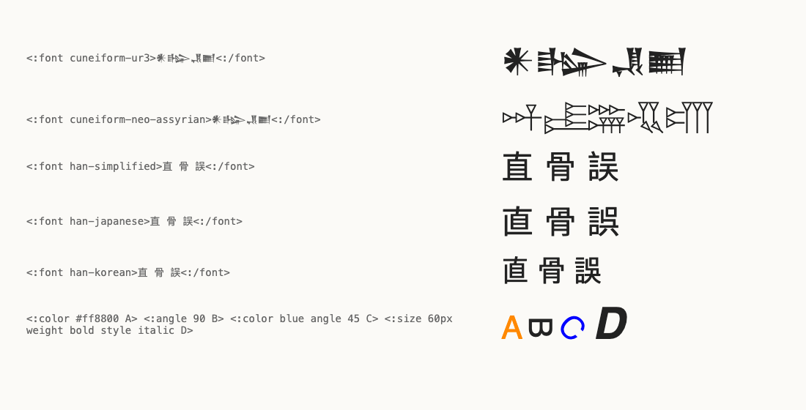

# Uniscript
  
**Uniscript** is a **human readable and editable** [unicode](https://en.wikipedia.org/wiki/Unicode) encoding format which only uses ASCII characters to describe code points.  
  
The constituents of uniscript are **entities** (like `\:alpha` for α) and **block types** (like  <:upper A> => ᴬ).    

## Block types
  
Block types influencing the character stream would be    
    
• **languages**       (greek a => α)    
• **modifiers**     (upper A => ᴬ , italic A => 𝐴 , bold A => 𝐀 , bold italic A => 𝑨 , bold alpha => 𝛂 … )    
• **calligraphic** hands (fracture A => 𝔄 , double-struck A => 𝔸 … )    
• **ligature**   (ligature ae => æ )    
• **colors**   (red circle ○ => 🔴, brown heart ♡ => 🤎)    
• **mirroring**     (reverseInPlace e => ɘ )    
• **text direction**     (phonician a b c => 𐤂 𐤁 𐤀 )    
• **icons**   (iconic warning ⚠ => ⚠️ emoji-style U+FE0F )    
• **plain**  (undo all styles to ⚠️ => ⚠ 𝐴 => A text-style 0xFE0E )    
  
Uniscript entities are case sensitive    
  
upper a => ᵃ  
upper A => ᴬ    

 
The full specification is [[docs/uniscript.md]]

# uniscript

**Type any Unicode character in plain ASCII, and style it: mirrored, rotated, colored.**

```
<:alpha> <:fracture Hello> <:double R> \:infinity     →   α ℌ𝔢𝔩𝔩𝔬 ℝ ∞
<:red ○> or <:red circle> → 🔴
<!-- <:mirror red R>                                     →   a mirrored red R  (if renderer supports it) -->
```



Uniscript is a human-readable spelling of Unicode that uses only ASCII: every character has a name (`<:alpha>`,
`<:greek small letter alpha>`, `<:dopf>`), every style is a block type (`<:bold …>`, `<:fracture …>`, `<:upper 2>` → ²),
and it converts back: `to_uniscript("α 𝔄")` gives `<:alpha> <:fracture A>`.

Unicode has no characters for a mirrored R or a red A, so uniscript adds them as invisible **suffix controls**: the letter
followed by TAG characters (U+E0020…E007E). Any font shows the plain letter. The **Uniscript fonts** show the effect:
`<:mirror red R>` is `R` + TAG r + TAG M.

- **40,000 names**: Unicode 16 character names, LaTeX `unicode-math` commands, HTML5 entities, and uniscript's own names.
- **Block types**: bold, italic, script, fracture, double-struck, sans, monospace, superscript (`upper`), subscript
  (`lower`), small capitals, circled, fullwidth, ligatures, phonetic Greek (`<:greek athos>` → αθοσ, `<:greek> filosofia kosmos<:/greek>` → φιλοσοφια κοσμοσ).
- **Styles combine** in any word order: `<:bold italic alpha>` → 𝜶, `<:sans bold A>` → 𝗔, `<:fraktur bold A>` → 𝕬.
- **Effects**: mirror, flip, turn, left, right and 11 colors, which you can stack: `<:mirror red R>`.
- **Hieroglyphs**: `<:egyptian A1>` (alias `gardiner`, Gardiner numbers and descriptions), `<:anatolian CAPUT>` (alias
  `luwian`: Laroche numbers, Latin logogram names, syllabic values `ka` `tá`/`ta2`, from Unicode's NamesList), and
  `<:hieroglyph …>`, which looks in both (Egyptian first).
- **Groups**: Egyptian hieroglyph joiners (`<:above 𓀀 𓁐>`) and CJK composition (`<:beside 犭 句>` → 狗).
- **Meta information**: font styles for scripts Unicode unified (`<:font cuneiform-old-babylonian> … <:/font>`,
  `<:font han-japanese>`), languages, colors and angles (`<:color #ff8800 angle 90 A>`), carried in plain text as
  invisible TAG sequences and rendered by `--html` as spans with CSS.
- **Honest**: an unknown name is an error. A character without a counterpart (`<:fracture 7>`) stays plain with a
  warning that can be made an error (`--strict`).
- **Three implementations, one data file**: this Rust crate, a Swift package, and `uniscript.wasp` in
  the [wasp](https://github.com/pannous/warp) language, all in this repository. All three read `data/entities.idx`.
  In wasp, `use uniscript` fetches this repository as a package and loads `uniscript.wasp`.

The full specification is [docs/uniscript.md](docs/uniscript.md)  
<!-- , a hard link to the [uniscript page of the warp wiki](https://github.com/pannous/warp/wiki/uniscript). -->
<!-- It covers the representation, escaping, the comparison with LaTeX, the Unicode extensions uniscript wishes for, and why controls follow their character. -->

## Try it

Online, two pages:
- **[pannous.com/uniscript](https://pannous.com/uniscript/)**: the converter with example buttons and a Unicode ⥊ UniScript
  box, running [[uniscript.wasp]] compiled to WebAssembly by warp.
- **[pannous.com/uniscript/rust](https://pannous.com/uniscript/rust/)**: [docs/demo.html](docs/demo.html), this Rust crate
  compiled to WebAssembly ([wasm/](wasm/)), with a live editor that renders meta information (fonts, colors, angles) as
  HTML. 
  <!-- Redeploy with `docs/make_demo.sh deploy`. -->

### Rust
```sh
cargo install uniscript               # or: cargo install --git https://github.com/pannous/uniscript
uniscript "<:alpha> <:fracture A>"     # α 𝔄
uniscript -r "α 𝔄"                     # <:alpha> <:fracture A>
uniscript /path/notes.txt               # the file's content converted (-r: back to uniscript)
echo "<:beside 犭 句>" | uniscript      # ⿰犭句 (狗 in the Uniscript CJK font)
uniscript --html "<:font cuneiform-hittite>𒀭<:/font>"   # <span lang="hit-Xsux" style="font-family: 'UllikummiA', …">𒀭</span>
```

## Fonts
Basic Uniscript does **not require special fonts**, and the standard should be backwards compatible so that __features__ not available in the renderer are simply ignored! Whenever the Unicode standard provides a built-in character for some entity or combination, it will be used immediately, so most of the above examples work out of the box: `<:alpha> <:fracture A>` => `α 𝔄` ...

However, the goal of Uniscript is to have a **universal language** to describe any kind of modifications, and for combinations that are not part of standard Unicode, we need some special magic: 
Some experimental fonts make special __tags__ available directly without requiring HTML.

Download them from the [releases](https://github.com/pannous/uniscript/releases). Their license is the SIL Open Font License.

| font | shows |
|---|---|
| **Uniscript Sans** (from Noto Sans + Noto Sans Math) | every geometry and color on ASCII and Greek, and one effect at a time on Latin-1/Ext-A, Greek, symbols, arrows and operators; mirror and turn on the rest |
| **Uniscript CJK** (from Noto Sans CJK) | IDS composition (⿰犭句 → 狗, 27,688 sequences) and mirror for radicals and the 3,755 most common hanzi |
| **NewGardinerOmni** (M.-J. Nederhof) | hieroglyph groups with the Unicode 15 joiners and the mirror control U+13440 |

## Support

Libraries for UniScript are provided for all major programming languages in this repository:
Swift, Rust, Python, JavaScript/TypeScript, C and C++. The Rust crate is the reference implementation. Swift, TypeScript, Python and C each have a native port of it, and Python and C/C++ also have wrappers around the Rust crate (FFI), with the same API as their native port. For fast web use, we recommend the compiled WebAssembly, as shown in [docs/demo.html](docs/demo.html). All of them pass the same reference cases:

- **Swift** (a direct port, SwiftPM, macOS 13+/iOS 16+): `.package(url: "https://github.com/pannous/uniscript", from: "1.0.0")`, product `Uniscript`; `xcrun swift test`, usage in [Swift](#swift).
- **C / C++** (Rust-backed, `c/ffi`): header `c/uniscript.h`, header-only C++17 wrapper `c/uniscript.hpp`; `make -C c/ffi` builds `c/ffi/build/libuniscript.{a,dylib}` to link directly (no install target: the native library installs the same API), `make -C c/ffi test`, usage in [c/ffi/README.md](c/ffi/README.md).
- **C, native** (C11, no dependencies, `c/native`): the same `c/uniscript.h` and C++ wrapper as `c/ffi`, drop-in interchangeable, index compiled in; install with `brew install pannous/tap/libuniscript` (the Rust CLI: `brew install pannous/tap/uniscript`), with Conan (`packaging/conan`), or from the release tarball `uniscript-c-VERSION.tar.gz` or a checkout: `make -C c/native install PREFIX=/usr/local` (libraries, `uniscript.h`, `uniscript.hpp`, the CLI and `uniscript.pc`, so `cc app.c $(pkg-config --cflags --libs uniscript)`); `make -C c/native test` runs the shared cases under sanitizers.
- **Rust** (the reference, crate `uniscript`): `cargo add uniscript`, then `uniscript::to_unicode("<:alpha>")`; `cargo test`.
- **WebAssembly** (the Rust crate, `wasm/`, npm package `@pannous/uniscript-wasm`): `npm install @pannous/uniscript-wasm`, `import init, { convert, toUniscript } from "@pannous/uniscript-wasm"; await init();` then the API of the TypeScript port; `cd wasm && npm test`, live in [docs/demo.html](docs/demo.html).
- **TypeScript / JavaScript** (a direct port, `js/`, npm package `@pannous/uniscript`, ESM for Node and browsers): `npm install @pannous/uniscript`, `import { toUnicode, convert, toUniscript } from "@pannous/uniscript"` loads the bundled `entities.idx`; `@pannous/uniscript/core` takes your own bytes (`new Uniscript(new EntityIndex(bytes))`); `cd js && npm test`.
- **Python, pure** (no dependencies, `python/native`, package `uniscript-py`): `pip install uniscript-py`, `import uniscript; uniscript.to_unicode("<:alpha>")`, reads `entities.idx` in place via mmap, same API as the FFI package; `cd python/native && PYTHONPATH=. python3 -m pytest tests`, usage in [python/native/README.md](python/native/README.md).
- **Python, Rust-backed** (PyO3, `python/ffi`, package `uniscript-rs`, abi3 wheels for macOS and Linux): `pip install uniscript-rs`, the same `import uniscript` API as the pure package, about 6× faster on documents; `python/ffi/build.sh` (maturin, installs into the system python), `python/ffi/test.sh`.
- **IntelliJ IDEs** (`intellij/`, Kotlin port): *Settings | Plugins | Marketplace* → `Uniscript`, or *Install Plugin from Disk…* with the zip of `cd intellij && ./gradlew buildPlugin`; see [intellij/README.md](intellij/README.md).
- **Sublime Text** (`sublime/Uniscript`, runs the `uniscript` CLI): Package Control *Add Repository* `https://raw.githubusercontent.com/pannous/uniscript/main/sublime/repository.json`, then *Install Package* `Uniscript`; see [sublime/Uniscript/README.md](sublime/Uniscript/README.md).

Programming languages supporting Uniscript natively are wasp and warp. 

An example native app with built-in support on the Mac: you can use it with Markdown via [MarkdownPreview](https://github.com/pannous/MarkdownPreview)

Future: hopefully this will develop into its very own standard. 

# Header
A uniscript file may start with the header `<:uniscript version="https://uniscript.org/v1">`. Every implementation
(Rust, Swift, wasp) recognizes it only at the very start, converts it and one line break after it to nothing, reads every
`https://uniscript.org/vN` without warning (backwards compatible) and warns only about a foreign version (`unsupported uniscript version …`). Anywhere else `<:uniscript …>` is an unknown
entity; the escaped `<<::>uniscript version="https://uniscript.org/v1">` is the header as text.
Renderers might choose to switch on Uniscript mode when encountering the header or `<:` at the start of a file.
[Warp](https://github.com/pannous/warp/) has built-in support for Uniscript, so all code should be rendered with it. 

## Use

```rust
assert_eq!(uniscript::to_unicode("<:alpha> <:fracture A>")?, "α 𝔄");
assert_eq!(uniscript::to_uniscript("α 𝔄"), "<:alpha> <:fracture A>");

// warnings instead of stderr, or as errors
let (text, warnings) = uniscript::convert("<:fracture 7>", uniscript::WarningMode::Warn)?;   // "7", 1 warning
assert!(uniscript::convert("<:fracture 7>", uniscript::WarningMode::Error).is_err());
```

`to_uniscript` followed by `to_unicode` gives the original text back.

## Meta information

Unicode encodes characters, not glyphs, so a font normally belongs to markup. Unicode often unifies forms that carry
meaning (Cuneiform of different periods, Egyptian hieroglyphics versus hieratic, Han characters of different regions), uniscript can express that via **meta information**: one general grammar of invisible TAG sequences (A built-in Unicode mechanism that we can use). If a renderer does not support them, they are simply invisible. 

The design and its reasons: [docs/uniscript.md, "Meta information"](docs/uniscript.md#meta-information-fonts-languages-colors).

Depending on the context, these unicode tags can be used, for example, in HTML and Markdown:

| uniscript | plain text | HTML (`--html`) |
|---|---|---|
| `<:font japanese>直<:/font>` | TAG `japanese` 直 TAG `END` | `<span lang="ja" style="font-family: 'Noto Sans CJK JP', 'Hiragino Sans'">直</span>` |
| `<:color #ff8800 mirror A>` | A, TAG M, TAG `:color #ff8800` | `<span style="color: #ff8800">A…</span>` |

```rust
let converter = uniscript::Uniscript::default();
let (tagged, _) = converter.convert("<:font cuneiform-hittite>𒀭<:/font>", uniscript::WarningMode::Warn)?;
let (styled, warnings) = converter.meta_runs(&tagged);   // plain text + nested MetaRun { key, value, start, end }
let html = converter.html(&styled);
```



`probes/render_meta.sh` renders this sample; the font styles and meta keys are the sections `fonts` and `meta` of
`data/entities.wasp`.

### Swift

The same converter as a Swift package (`Package.swift`, `Sources/Uniscript`), reading the same `data/entities.idx`
(bundled as a resource through the symlink `Sources/Uniscript/entities.idx`; lookups read the memory-mapped bytes in place).

```swift
// .package(url: "https://github.com/pannous/uniscript", branch: "main"), product "Uniscript"
import Uniscript
try Uniscript.toUnicode("<:alpha> <:fracture A>")   // "α 𝔄", throws UniscriptError.unknownEntity / .unclosed; warnings to stderr
try Uniscript.convert("<:greek c>")                 // ("c", [Warning(message: "no greek form of c", at: 0)])
try Uniscript.convert("<:greek c>", mode: .error)   // throws UniscriptError.unsupported(warning)
Uniscript.toUniscript("α 𝔄")                       // "<:alpha> <:fracture A>"
let (styled, warnings) = Uniscript.standard.metaRuns(tagged)   // meta information, as in Rust
Uniscript.standard.html(styled)
```

`xcrun swift test` (in `tests/UniscriptTests`) runs the cases of `tests/uniscript_test.rs`, `tests/styles_test.rs` and `tests/meta_test.rs`
plus a walk over all index tables.

## Syntax

- `<:name>` or `\:name`: an entity. Names are case sensitive; spaces may replace hyphens (`<:greek small letter alpha>`).
- `<:type operands>`: a block type applied to space separated operands; `<:double-d>` works too.
- `<:type> … <:/type>` or `<:type> … <:>`: a block; its text is rendered as written, spaces included. In an inline tag
  `<:type a b>` the spaces only separate operands and are dropped.
- Effect words stack: `<:mirror red A>` gives A with the red and the mirror control.
- Style words stack too: the last styles the operands and the others restyle the result. They use the block that
  combines them in any order (`<:italic bold alpha>` → bold-italic → 𝜶). If no such block exists, they commute
  (`<:greek bold a>` → bold of greek a → 𝛂). A style Unicode has no combination for keeps the character with a warning:
  `<:double bold A>` → 𝐀.
- `<:` is the only special sequence. Escape it as `<<::>`, `<:less>:` or `<:<>:`; a lone `<` or `>` needs no escape.
- `<:key value>` … `<:/key>` and `<:key value operands>` with a meta key (`font`, `lang`, `color`, `background`,
  `angle`, `size`, `weight`, `style`, `features`): meta information. Entity names win: `<:angle>` is ∠.
- An unknown name is an error (`Error::UnknownEntity`, Swift `UniscriptError.unknownEntity`), never passed through silently.

## Data

| file | what |
|---|---|
| `data/entities.wasp` | the readable source of truth (wasp data syntax): Unicode 16 names, LaTeX (unicode-math) and HTML5 names, block types, font styles, meta keys |
| `data/entities.idx` | the binary index built from it, compiled into the library |
| `data/uniscript_index.py` | seeds `entities.wasp` from the sources (needs Python's `unicodedata` and TeX Live's `unicode-math-table.tex`) |


### Block control keys

| key | meaning |
|---|---|
| `*suffix` | follows any character without its own entry (colors: TAG letters U+E0020…, `iconic`: U+FE0F) |
| `*suffix egyptian` | the same, only after hieroglyphs (`mirror`: U+13440) |
| `*prefix cjk` | goes before the parts of a CJK group (IDS operators ⿰ ⿱) |
| `*infix egyptian` | goes between the parts of a hieroglyph group (joiners U+13430, U+13431) |
| `*rare` | a rare script's block (`egyptian`, `anatolian`): its names stay out of the web manifest and are fetched when used |
| `*meta` | the attached meta a block becomes where it has no suffix control (colors: `color red`, so `<:red 𓀀>` → 𓀀 + TAG `:color red`) |

## Licenses

Code: MIT. The seeded names come from the Unicode Character Database (Unicode License v3), the HTML5 entity list (W3C)
and unicode-math-table.tex (LPPL 1.3c). Fonts: SIL Open Font License 1.1.
